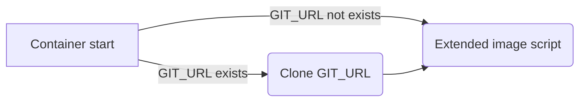
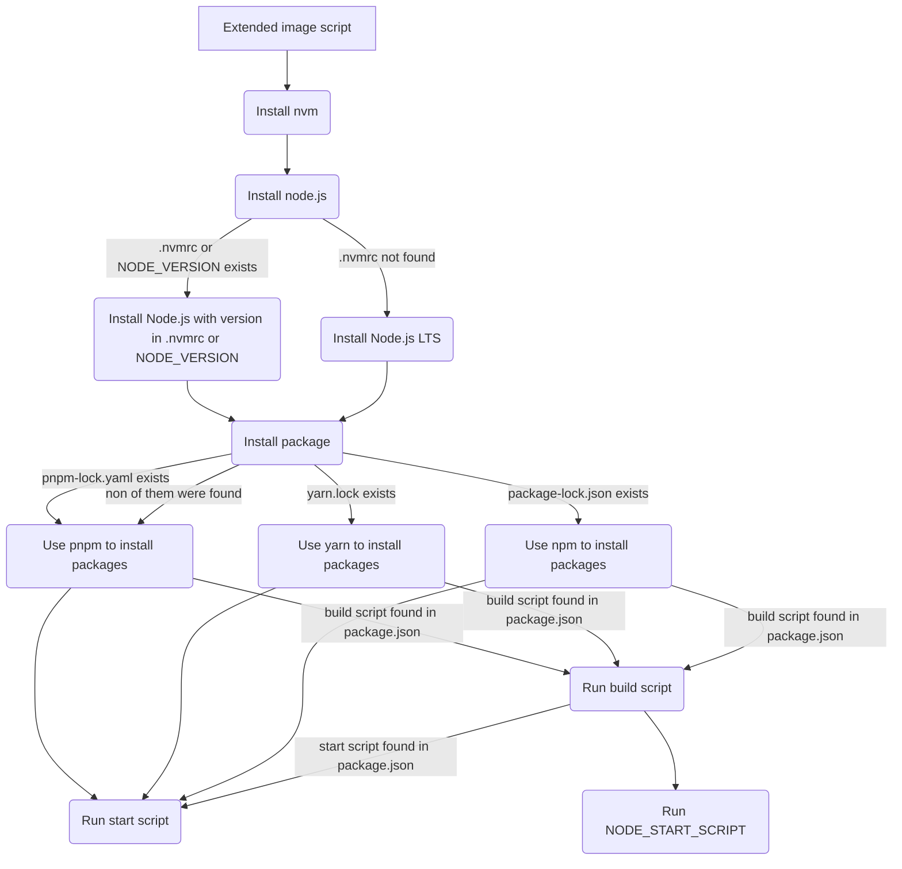

# 🐬 Dolphin
## All in one solution for hosting your code

> Dolphin is still under heavy development, please create a issue if you face any bugs or request a feature

## 🏃 Running image

```sh
docker run --name dolphin-box -d \
  -e GIT_URL="https://domain.com" \
  --restart unless-stopped \
  docker.io/wolfyuan/dolphin:node
```
---

Command breakdown:
`-e GIT_URL="https://domain.com"` - Environment variables for controlling container, see [here](#🌎️-environment-variables-and-workflow) for full list
`--restart unless-stopped` - Restart your container when it fail or you rebooted your machine, unless you stop it by yourself
`docker.io/wolfyuan/dolphin:node` - Container image, where `node` represents to image that's designed for this language, see [here](#📦️-container-images) for full list

## 📦️ Container images

> Most image supports `arm` based CPU unless mentioned in note.

| Image name |                       Description                      |      Variants      |   Tag  |                     Note                    |
|:----------:|:------------------------------------------------------:|:------------------:|:------:|:-------------------------------------------:|
|   Node.js  |  Image with necessary software to run Node.js software | `alpine`, `ubuntu` | `node` | `alpine` does not support `arm64`, `armv7l` |
|    Base    | Base image, you should NOT use this image when running | `alpine`, `ubuntu` | `base` |                      -                      |

### Tagging format

Images are tagged with this format: `[Image Tag]-[Image Variants]`
For example, `node` image with `ubuntu` base will be: `node-ubuntu`

## 🌎️ Environment variables and workflow

### Applies to every image:

Environment variables:

| Environment variables name |               Description               |
|:--------------------------:|:---------------------------------------:|
|          `GIT_URL`         | Git repo to clone when container starts |

Workflow:



<details>
<summary>node</summary>

Environment variables:

| Environment variables name |                        Description                        |
|:--------------------------:|:---------------------------------------------------------:|
|       `NODE_VERSION`       |       Node.js version to install, overrides `.nvmrc`      |
|     `NODE_START_SCRIPT`    | Script to run when container finished running init script |

Workflow:



> Diagram is a *little* bit complex

| 📝 Note                                |
|----------------------------------------|
| In package manager: `pnpm > yarn > npm`  |
| In node version: `NODE_VERSION > .nvmrc` |

</details>